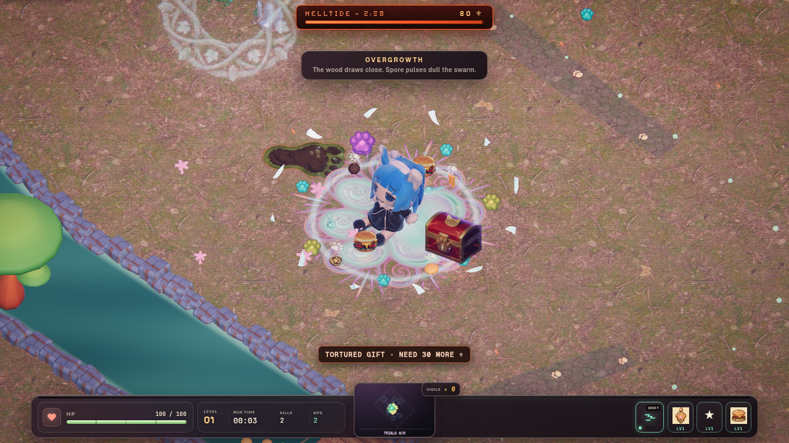
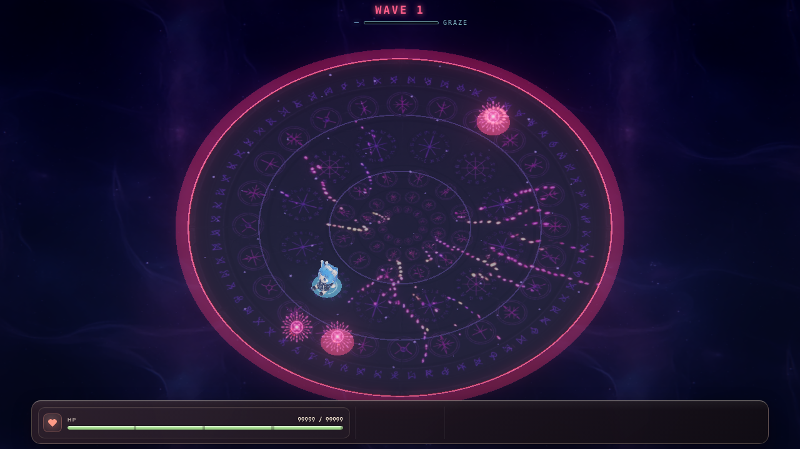
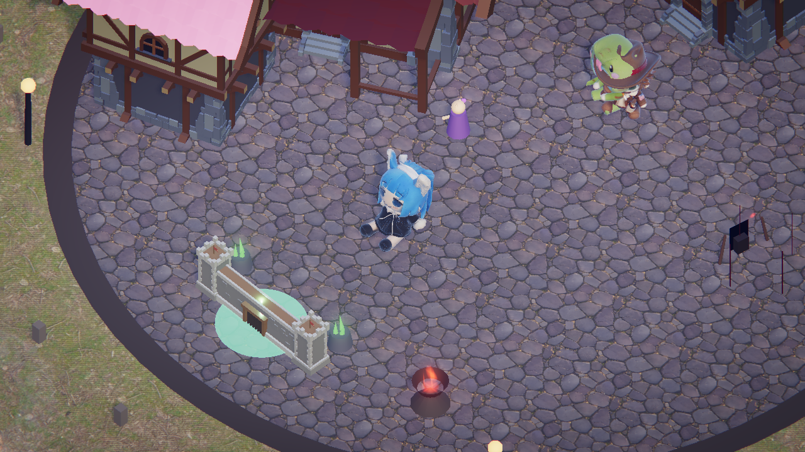
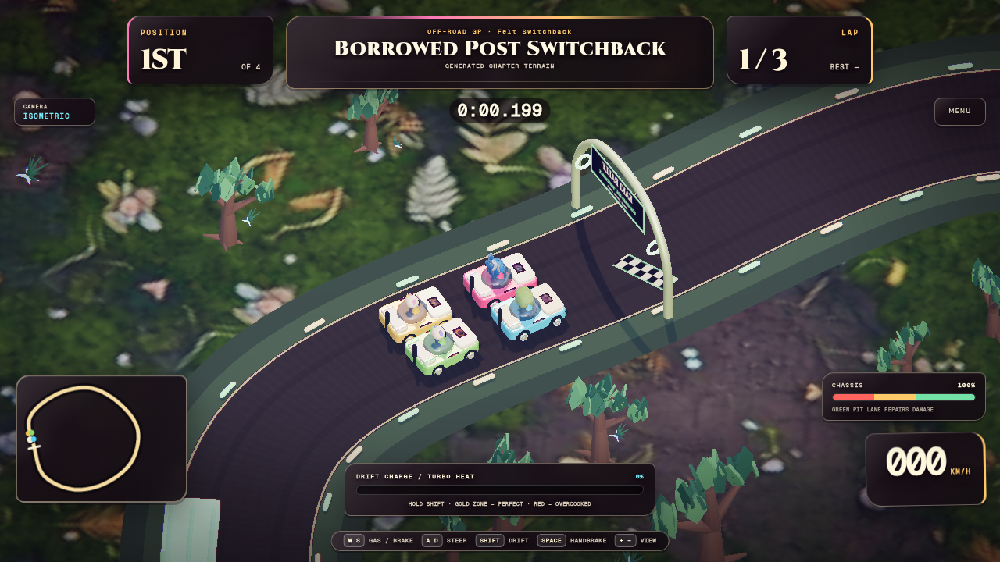

# Kaki Survivors

**▶ Play now: [dknos.github.io/Kaki-Survivors-2](https://dknos.github.io/Kaki-Survivors-2/)**

A Vampire-Survivors-style auto-attacking horde game built in **THREE.js** with no bundler. Slot-machine treasure chests, evolving weapons, animated bug swarms, branching meta tree, daily + weekly challenges, character signatures, and a shipped accessibility menu.

[**Play Now**](https://dknos.github.io/Kaki-Survivors-2/) · [**How to Play**](how-to-play.html) · [Report a Bug](https://github.com/dknos/Kaki-Survivors-2/issues)

## Gallery

| Survivors · Forest | Bullet Hell · Wave One |
| --- | --- |
|  |  |
| Town hub | Kaki Rally · Forest circuit |
|  |  |

<!-- TODO: assets/screenshot.png (1280x720) -->
<!-- TODO: assets/demo.gif    (loop, ~3s) -->

**Version:** v2.0.0 · **Status:** canonical WebGPU/refactor production release; Kaki Catastrophe is deferred.

**▶ Play locally:** `npx serve -l 5196 .` then open `http://localhost:5196/`.

## Controls

| Key | Action |
|---|---|
| **WASD / Arrows / Left Stick** | Move |
| **Space / A button** | Jump |
| **Shift / B button** | Dash (after unlock) |
| **Mouse / Right Stick** | Manual aim (optional) |
| **Mouse wheel / Pinch** | Zoom (after unlock) |
| **F1** | Codex |
| **F3** | Performance overlay |
| **ESC** | Options / close modal |
| **R** | Retry (on death/victory screen) |

### Kaki Rally controls

Choose **Kaki Rally** on the main menu. The selected chapter becomes the course for Off-Road GP, Drift Attack, and Kaki Stock Cup. **Monster Smash** opens the dedicated Crown Chaos Coliseum and lets you choose Mighty Meowster or Cyber Kaki. Choose **05 · Kaki Trials** for the side-scrolling mode.

| Key | Racing action |
|---|---|
| **W / S / Left Stick Y** | Accelerate / brake and reverse |
| **A / D / Left Stick X** | Steer |
| **Shift / Gamepad A** | Hold to drift; release a charged slide for mini-turbo |
| **Space** | Hop (ramps launch automatically) |

Monster Smash keeps the same small control surface but changes its air and boost behavior:

| Key | Crown Chaos action |
|---|---|
| **W / S / Left Stick Y** | Throttle / brake on dirt; pitch forward / back in air |
| **A / D / Left Stick X** | Steer on dirt; barrel-roll left / right in air |
| **Shift / Gamepad A** | Spend earned Zoomies on boost and stronger impacts |
| **Space** | Quick hop for small obstacles and timing corrections |

Smashes, airtime, varied stunts, and clean landings earn Zoomies and extend the Wreck Chain. Rough landings, inactivity, wrecks, and resets break it.

Kaki Trials uses focused side-view controls:

| Key | Trials action |
|---|---|
| **W / Left Stick up** | Throttle |
| **S / Left Stick down** | Brake, then reverse when stopped |
| **A / D / Left Stick X** | Lean nose up / nose down on hills and in the air |
| **Shift / Gamepad A** | Turbo; release before the heat meter overheats |
| **Space** | Restart from the last checkpoint without resetting the clock |

Earn at least a B medal to unlock the next of three courses. Style from air time, flips, clean landings, clean sections, and destruction converts into a capped time credit; a new personal best saves a local ghost for the next run.

Kaki Catastrophe is deferred from the canonical production roadmap while its dedicated rebuild is completed separately.

## Features

- **Five racing disciplines** — three chapter-derived Rally events, Crown Chaos Coliseum Monster Smash, and side-scrolling Kaki Trials.
- **4 weapons + evolutions** — Holy Croissants, Magic Missile, Chain Lightning, Sticky Web. Each evolves at max level + 3 picks of a paired filler: Toxic Halo, Storm, Volley, Tangle.
- **6 characters with signatures** — Kitty (Nine Lives), Boom (Charged Coil), Webspinner (Lingering Silk), Sniper (Headhunter), Phoenix (Ember Burst), Clockwork (Tempo).
- **6 authored stages + per-stage rules** — Forest, Twilight, Cinder, Void, Cave, and the Kaki Land final chapter each have distinct hazards, landmarks, interactables, and horde rules.
- **Exploration map** — Forest tracks six sealed Grove Trials; Twilight through Cave track live Portal Shards, bridges, terrain cuts, dungeon stairs, the hero, and ready portals; Kaki Land is a three-trial floating-island route that opens the Sovereign Gate.
- **Procedural Catacomb** — sealed room-by-room progression, dedicated portcullis doors, a Crypt Warden boss, and a claim-gated golden reward.
- **Purposeful terrain** — animated creeks, moonwater, lava ravines, abyss fractures, canyon banks, and Blender-authored safe crossings; water slows and dangerous cuts deal damage.
- **Enemy affixes** — Volatile / Vampiric / Leaping / Shielded / Swift / Frosted with distinct tells and counterplay.
- **Per-boss patterns** — Engulf, Sonic Cone, Quake Cross, Nightmare cycle replace the one-trick shockwave.
- **Branching shop tree** — 3 branches × 4 tiers = 12 nodes. Tier-4 capstones (Phoenix, Overdrive, Treasure Map) are real, wired effects.
- **Treasure chests + slot machine** — drops from elites + every 75s. 7-7-7 jackpot = max upgrade. Double-or-nothing gamble.
- **Daily Challenge + Weekly Mutator** — same seed for all players; weekly rotates Monday with rule-changing modifiers.
- **Hall of Records (local)** — top runs across all characters/stages.
- **Achievement DAG + Codex** — discovery log unlocks as you encounter content.
- **Share card** — 1200×630 PNG of a run, copy-and-paste-ready for Discord / Twitter.
- **Accessibility menu** — separate Master / Music / SFX volume, Reduce Motion, Reduced Flashing, High Contrast, Colorblind palette, Font Scale, Frame Cap, Controller Deadzone, Save Export/Import, Reset Progress.
- **Visual polish** — selective bloom, vertex-shader leg/wing animation, HDRI environment, blob shadows, rim light, ACES Filmic tone mapping, height fog, LGG color grade.

## Stack

- **THREE.js r185 / 0.185.1** vendored via import map (no bundler)
- **Three.js WebGPU renderer + TSL** with automatic WebGL 2 fallback through the same backend-neutral rendering service
- **No bundler or TypeScript** — native ES modules plus focused browser smoke suites for combat lifecycle, the five overworld landscapes plus Kaki Land, portal entry, and procedural dungeon progression.
- DPR 1.25 cap, half-resolution selective-bloom pipeline, sprite-batched hordes, and dense InstancedMesh-pooled FX (kill rings, sparks, gems, blob shadows, pickups, leap markers, ranged tells)
- Procedural particle textures + procedural Web Audio (music split from SFX)
- TSL node materials for portable rim lighting, creature animation, landscapes, hazards, and post-processing
- Per-instance material clone for damage flash + hue jitter

## Credits

Made by [@dknos](https://github.com/dknos).

**Models — all CC0 / CC-BY:**
- **Quaternius** — Ultimate Monsters bundle (Mushnub, Cactoro, Goleling, Orc, Demon, Yeti, Pink Slime, Ghost, Dragon, Mushroom King, Wasp, Spider, Wolf) and chest models — CC0
- **Poly by Google** (via [Poly Pizza](https://poly.pizza)) — Beetle, Ladybug, Grasshopper, Mantis, Cockroach, Ant, Bee, Butterfly, Caterpillar — CC-BY

**Textures &amp; HDRI:**
- **Poly Haven** — `forrest_ground_01` (1k diff/rough/normal), `approaching_storm` HDRI — CC0

**Tech:**
- [THREE.js](https://threejs.org) WebGPU renderer + TSL, with GLTFLoader and DRACOLoader
- [Rapier 3D](https://github.com/dimforge/rapier.js) — Apache-2.0; vendored locally for deferred crash-mode work
- Original bridge, canyon-bank, and portcullis kit authored with Grok Imagine material studies and Blender.

**Inspiration:** Vampire Survivors, Halls of Torment, Hades.

## Architecture

```
src/
  main.js              # bootstrap + RAF loop + context-loss handlers
  state.js             # single mutable game state
  config.js            # tunables (DAMAGE, JUMP, DASH, ENEMY_TIERS, etc.)
  assets.js            # GLTF preload, material upgrade, vertex anim injection
  particleTextures.js  # canvas-rendered glow/spark/smoke textures
  postfx.js            # bloom composer + composite + LGG grade + height fog
  env.js               # ground, lights, HDRI environment, scenery scatter
  hero.js              # input → movement/jump/dash/walk anim/death anim
  enemies.js           # spawn, pool, AI, AnimationMixer, proc anim, flash, DoT
  enemyAffixes.js      # Volatile / Vampiric / Leaping / Shielded / Swift / Frosted
  enemyTells.js        # InstancedMesh ranged-tells, threat dots, leap markers
  enemyProjectiles.js  # wizard fireballs
  bossTelegraphs.js    # per-boss attack tells (engulf / cone / cross / nightmare)
  fx.js                # InstancedMesh pools: kill rings, sparks, pickup ring
  blobShadows.js       # InstancedMesh of soft dark circles under characters
  damageNumbers.js     # DOM-overlay floating numbers (1.2K format)
  xp.js                # gem InstancedMesh + magnetize + per-tier color
  pickups.js           # 3D extruded heart + star pickups
  chest.js             # chest spawn + open-flash + slot machine trigger
  slotMachine.js       # symbols, outcome resolution, jackpot apply
  spawnDirector.js     # D(t) curve, hordes, ebb/surge, mini-bosses @ 2:30/5:30/8:00, final @ 10:00
  stageLandscapes.js   # deterministic, instanced biome compositions + terrain rendering
  stageTerrainLayout.js # shared bridge/canyon truth for visuals, hazards, shards, minimap
  portalShards.js      # five-shard objective + overworld minimap + dungeon portal (Kaki Land owns three portal trials)
  catacomb.js          # transactional procedural-dungeon session + room progression
  dungeonBuild.js      # instanced dungeon kit, animated doors, grid collision
  meta.js              # localStorage save (coins/sigils/runs/best/achievements)
  ui.js                # HUD, level-up modal, death screen, banners, toasts, credits
  audio.js             # procedural Web Audio sfx + tiered music (Master/Music/SFX)
  input.js             # keyboard / touch / wheel zoom (notched) / Shift dash / Space jump
  racing/              # Rally, Draw Track, Monster Smash, Trials, shared cameras, and dispatch
    crash/             # isolated Rapier crash world, traffic, damage, scoring, Kaki Boom, replay, HUD
  gamepad.js           # gamepad mapping + deadzone (configurable)
  uiFocus.js           # focus-scope stack + arrow/enter navigation
  weeklyMutator.js     # 7-day rotating rule modifiers
  weapons/
    index.js           # registry, evolutions, fillers
    orbitals.js        # Holy Croissants → Toxic Halo
    autoAim.js         # Magic Missile → Volley
    chain.js           # Chain Lightning → Storm
    web.js             # Sticky Web → Tangle
```

## License

Code under MIT — see [LICENSE](LICENSE). Assets keep their original CC0 / CC-BY terms (see Credits above).
